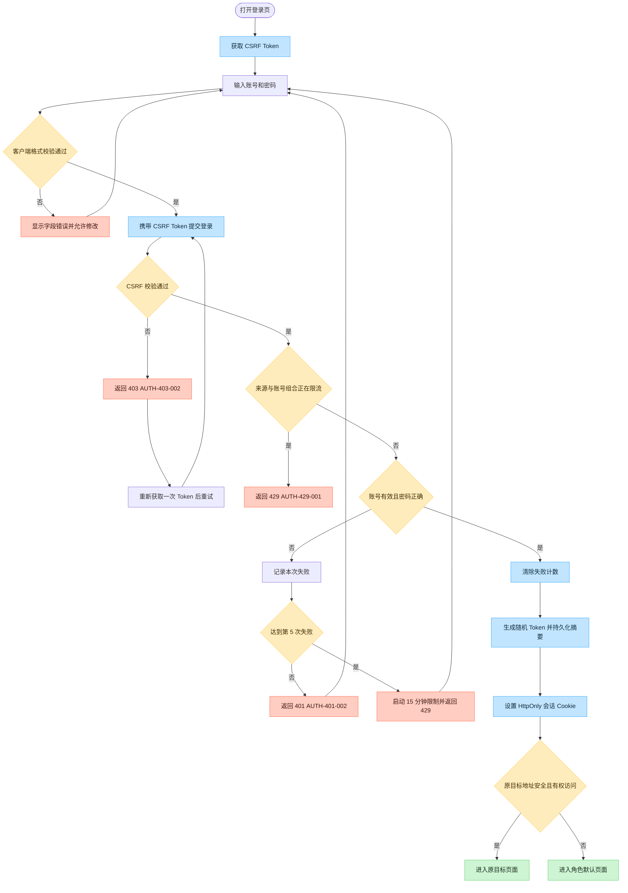
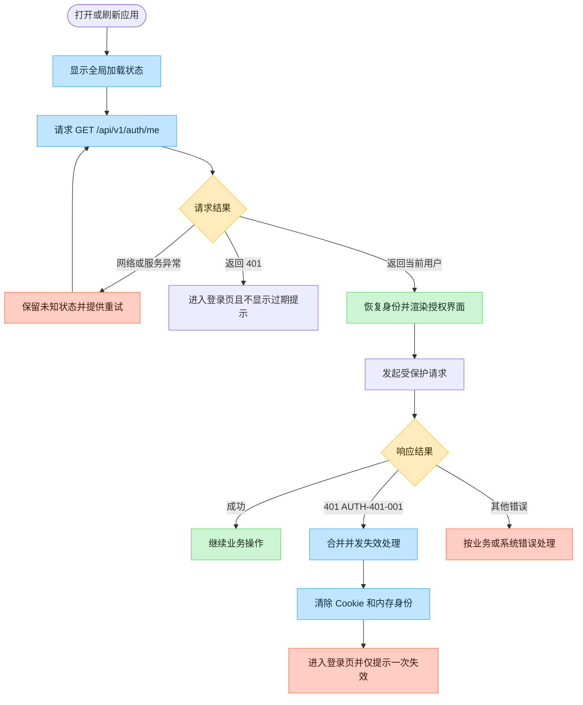
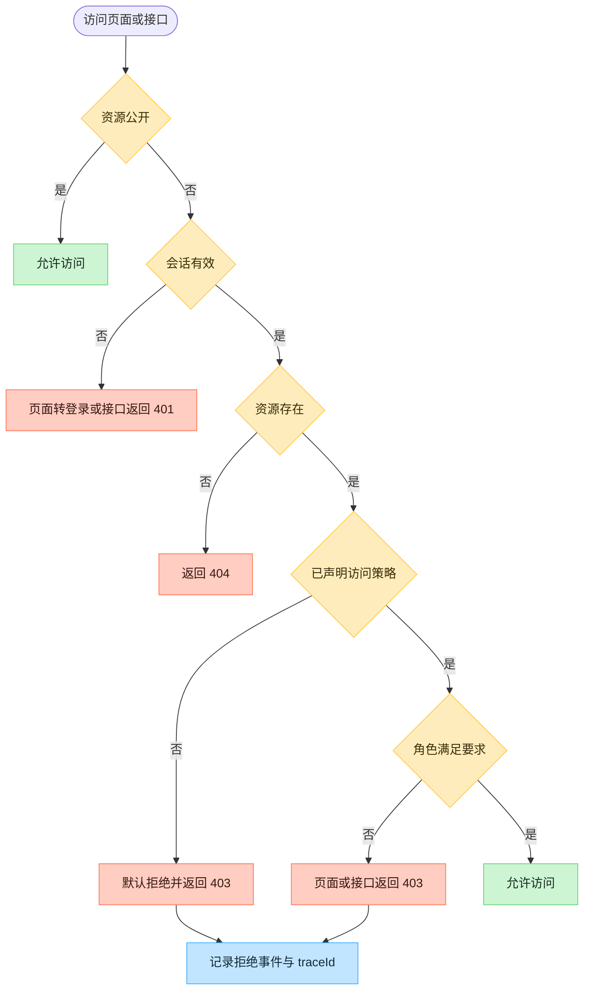
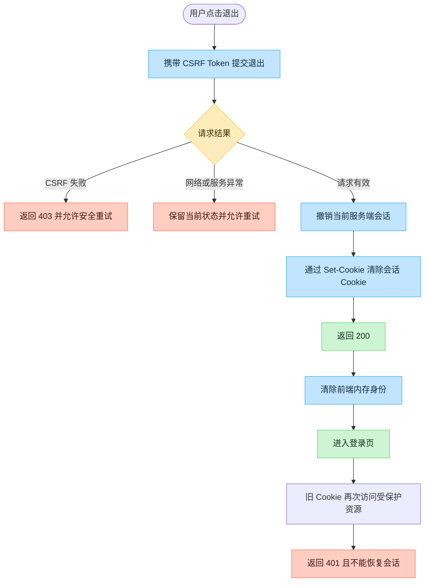
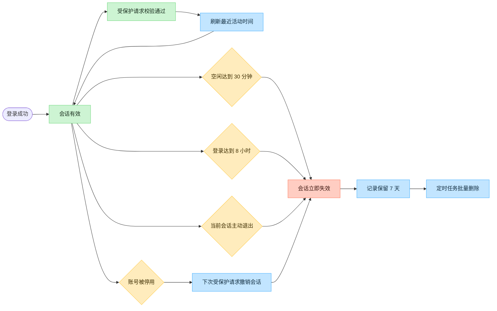

# Cup Flow Coffee POS — Sprint 2 登录体系流程图

| 属性 | 内容 |
| --- | --- |
| 文档版本 | v1.0 |
| 状态 | Sprint 2 已批准需求的流程基线 |
| 基线日期 | 2026-08-24 |
| 适用范围 | 登录、会话、退出、角色权限与安全失败处理 |
| 需求来源 | `PRD.md`、`API_CONTRACT.md`、`USER_STORIES.md` |

> 本文描述目标行为，用于产品、研发与测试评审，不表示所有节点均已完成开发。

## 1. 登录体系总览

```mermaid
flowchart LR
    visit([用户访问系统]) --> boot[应用启动并确认身份]
    boot --> sessionValid{当前会话有效}
    sessionValid -->|否| loginPage[进入登录页]
    loginPage --> authenticate[提交账号和密码]
    authenticate --> loginSuccess{认证成功}
    loginSuccess -->|否| loginPage
    loginSuccess -->|是| createSession[建立服务端会话]
    sessionValid -->|是| authorizeTarget[校验目标资源权限]
    createSession --> authorizeTarget
    authorizeTarget --> targetAllowed{目标存在且有权访问}
    targetAllowed -->|是| targetPage[进入原目标页面]
    targetAllowed -->|否| roleHome[进入角色默认页面]
    targetPage --> protectedAccess[访问受保护页面或接口]
    roleHome --> protectedAccess
    protectedAccess --> guard{会话和角色校验通过}
    guard -->|是| resource[返回业务资源]
    guard -->|会话失效| loginPage
    guard -->|角色不足| forbidden[返回 403]
    resource --> logout[用户主动退出]
    logout --> loginPage

    classDef success fill:#CDF4D3,stroke:#66D575,color:#172B1C
    classDef failure fill:#FFCDC2,stroke:#FF7556,color:#3D1710
    classDef decision fill:#FFECBD,stroke:#FFC943,color:#3D2D00
    classDef security fill:#C2E5FF,stroke:#3DADFF,color:#102B3D
    class targetPage,roleHome,resource success
    class forbidden failure
    class sessionValid,loginSuccess,targetAllowed,guard decision
    class boot,authenticate,createSession,authorizeTarget,protectedAccess,logout security
```

角色默认页面：`CASHIER` 为 `/pos`，`ADMIN` 为 `/dashboard`。`ADMIN` 继承 `CASHIER` 的业务权限。

## 2. 登录认证流程

关键规则：

- 账号先去除首尾空白，长度为 1–64 个字符且区分大小写；密码保持原值，长度为 1–128 个字符。
- 格式不合法返回 `400`，不进行密码校验，也不计入登录失败次数。
- 账号不存在、密码错误和账号停用统一返回 `401 / AUTH-401-002`，避免泄露账号状态。
- 限流维度为“来源 IP + 规范化账号标识”。前 4 次失败返回 `401`，第 5 次起进入 15 分钟限制并返回 `429 / AUTH-429-001`；限制期内的尝试不延长窗口。
- 浏览器 Cookie 保存随机原始 Token，数据库仅保存其 SHA-256 摘要。Cookie 名为 `CUP_FLOW_SESSION`，使用 `HttpOnly`、`SameSite=Lax`、`Path=/`，生产环境启用 `Secure`。
- 返回地址仅接受以单个 `/` 开头的站内路径；`//`、协议、主机、反斜杠和控制字符均视为无效。

## 3. 启动恢复与运行中会话失效

服务端校验会话时，以 Token 摘要查询持久化记录，并检查撤销状态、30 分钟空闲时限、登录后 8 小时绝对时限以及账号是否仍为 `ACTIVE`。校验通过的受保护请求刷新最近活动时间，但不会延长绝对时限。

## 4. 受保护页面与接口授权

前端路由和菜单用于改善体验，后端鉴权是最终安全边界。未分类业务接口默认拒绝；“资源不存在”的 `404` 与“角色不足”的 `403 / AUTH-403-001` 必须保持可区分。

| 能力 | 未登录 | `CASHIER` | `ADMIN` |
| --- | --- | --- | --- |
| 登录、CSRF | 允许 | 允许 | 允许 |
| POS、订单 | 拒绝 | 允许 | 允许 |
| 商品、经营看板 | 拒绝 | 拒绝 | 允许 |

## 5. 主动退出流程

退出仅撤销当前会话并保持幂等，不影响同一账号的其他并发会话。后端不可达时，前端不能伪装退出成功。

## 6. 会话生命周期

浏览器关闭后，因为会话 Cookie 不持久化，浏览器侧登录态结束；服务端记录仍按自身生命周期和清理规则管理。

## 7. 接口与失败结果速查

| 场景 | 接口或入口 | 结果 |
| --- | --- | --- |
| 获取安全令牌 | `GET /api/v1/auth/csrf` | 返回 CSRF Header 名称和 Token，不建立登录会话 |
| 登录成功 | `POST /api/v1/auth/login` | `200`、返回 `CurrentUser`、设置会话 Cookie |
| 登录凭证失败 | `POST /api/v1/auth/login` | `401 / AUTH-401-002` |
| 登录限流 | `POST /api/v1/auth/login` | `429 / AUTH-429-001`，包含 `Retry-After` |
| 查询当前身份 | `GET /api/v1/auth/me` | 有效会话返回 `CurrentUser`；无效会话返回 `401 / AUTH-401-001` |
| 角色不足 | 受保护页面或接口 | `403 / AUTH-403-001` |
| CSRF 或 Origin 失败 | 登录或退出 | `403 / AUTH-403-002` |
| 主动退出 | `POST /api/v1/auth/logout` | 撤销当前会话、清除 Cookie、幂等返回 `200` |

## 8. User Story 追踪

| 流程 | 覆盖的 User Story |
| --- | --- |
| 登录认证 | `US-S2-AUTH-01`、`US-S2-AUTH-02`、`US-S2-SEC-01` |
| 启动恢复与会话失效 | `US-S2-SESSION-01`、`US-S2-SESSION-02` |
| 主动退出 | `US-S2-SESSION-03` |
| 页面与接口授权 | `US-S2-AUTHZ-01`、`US-S2-AUTHZ-02`、`US-S2-AUTHZ-03` |
| 安全事件记录 | `US-S2-AUDIT-01`，横切全部认证、会话和授权流程 |

安全事件必须包含可关联的 `traceId`，但不得记录密码、Cookie、原始 Token、密码哈希或其他凭证材料。
