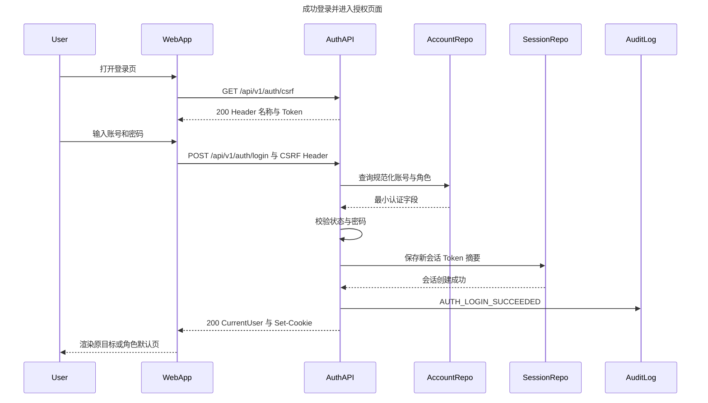
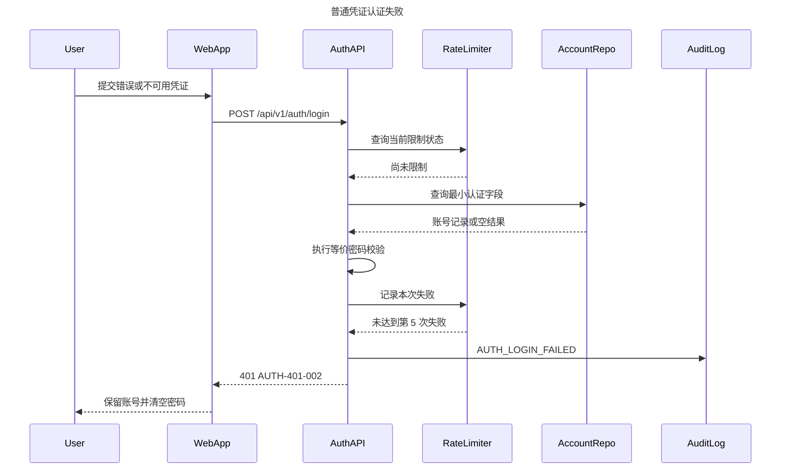
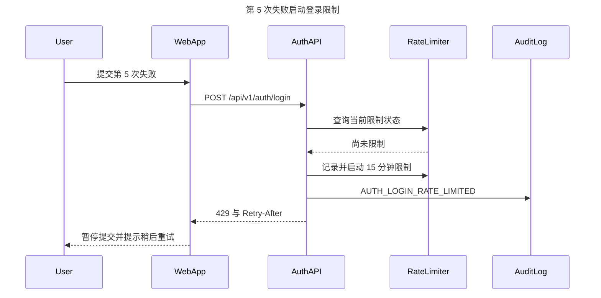
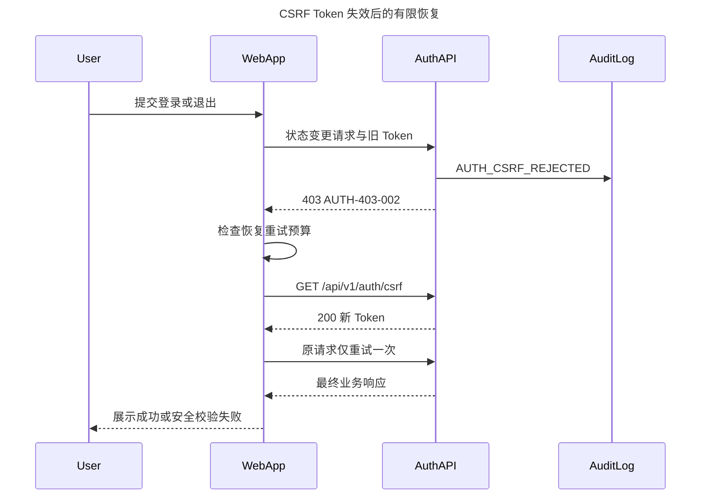
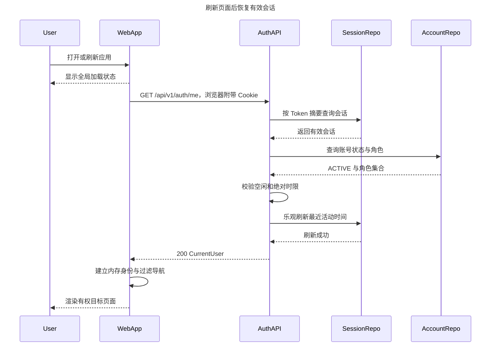
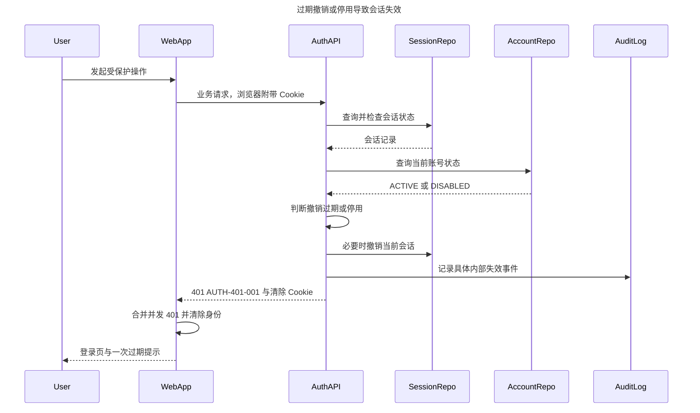
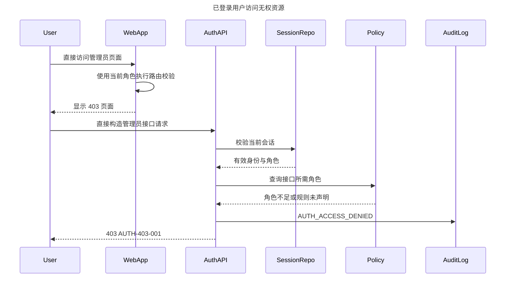
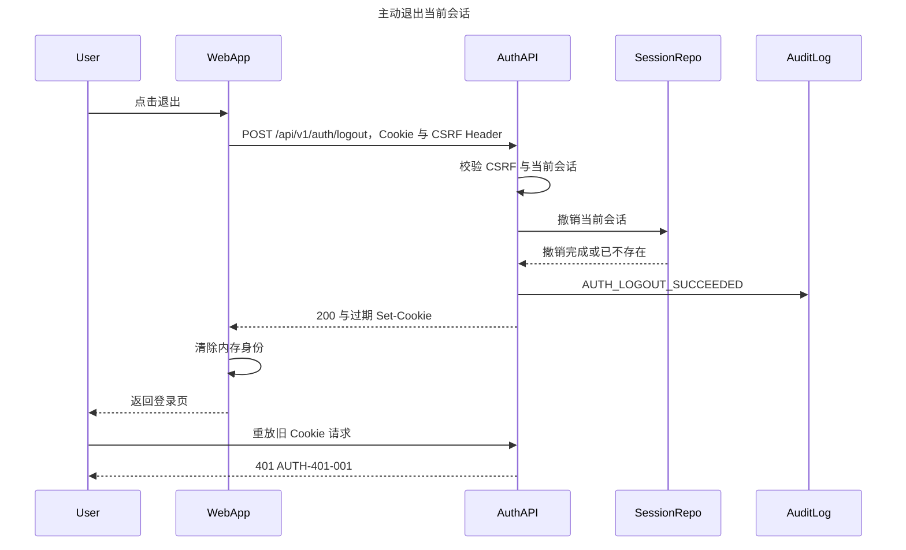

# Cup Flow Coffee POS — Sprint 2 登录体系时序图

| 属性 | 内容 |
| --- | --- |
| 文档版本 | v1.0 |
| 状态 | Sprint 2 已批准需求的时序基线 |
| 基线日期 | 2026-08-24 |
| 适用范围 | 登录、CSRF、限流、会话恢复与失效、授权、退出 |
| 需求来源 | `PRD.md`、`API_CONTRACT.md`、`USER_STORIES.md` |

> 本文描述目标交互，用于产品、前端、后端和测试评审，不表示所有参与方均已完成开发。为了清晰表达不同结果，每张图只描述一个具体场景。

## 1. 参与方说明

| 参与方 | 职责 |
| --- | --- |
| `User` | 收银员、管理员或未登录访问者 |
| `WebApp` | 运行于浏览器，负责页面、认证状态和路由；浏览器自动管理 `HttpOnly` Cookie |
| `AuthAPI` | 认证接口、会话校验和统一安全边界 |
| `AccountRepo` | 查询最小账号认证字段、状态与角色 |
| `SessionRepo` | 创建、查询、刷新和撤销服务端会话 |
| `RateLimiter` | 按来源 IP 与规范化账号标识管理登录失败限制 |
| `Policy` | 后端接口角色策略与默认拒绝规则 |
| `AuditLog` | 记录脱敏安全事件及 `traceId` |

## 2. 成功登录

登录请求携带内存中的 `X-XSRF-TOKEN`。浏览器保存原始随机会话 Token，数据库只保存不可反推的摘要。返回地址只有在属于安全站内路径且当前角色有权访问时才恢复，否则进入 `/pos` 或 `/dashboard`。

## 3. 认证失败与登录限流

账号不存在、密码错误和账号停用走等价校验路径，对客户端保持统一反馈。

同一组合继续失败并达到第 5 次时进入限制：

字段为空或超长时返回 `400 / COMMON-400-001`，不进入密码验证，也不累计失败次数。限制期间的请求继续返回 `429`，但不延长限制窗口；成功登录会清除对应组合的失败状态。

## 4. CSRF 校验失败与一次恢复

该恢复只处理 Token 轮换或页面持有旧 Token 等可恢复情况。若已经重试过，或者重新获取后仍返回 `AUTH-403-002`，客户端必须停止自动重试，提示刷新页面并保留 `traceId`。CSRF Token 只保存在内存中，不写入 URL 或日志。

## 5. 应用启动与会话恢复

会话 Cookie 为 `HttpOnly`，因此 WebApp 不读取其内容，只通过 `/auth/me` 结果建立内存身份。确认完成前不得渲染受保护内容。网络或服务异常应进入可重试状态，不能伪装成未登录或凭证错误。

## 6. 运行中会话失效

30 分钟空闲过期、登录后 8 小时绝对过期、已撤销会话和停用账号均对客户端保持同一 `401 / AUTH-401-001` 边界。失效请求不得读取或修改业务数据；内部仍分别记录过期、撤销或停用事件。

## 7. 角色不足与后端独立拒绝

前端菜单和路由只负责体验，后端是最终权限权威。业务接口未声明策略时默认拒绝；不存在的资源返回 `404 / COMMON-404-001`，不能一律伪装成 `403`。

## 8. 主动退出与旧会话失效

退出只撤销当前会话，不影响同账号的其他并发会话，并且重复退出保持 `200` 幂等。若后端不可达，WebApp 必须保留当前状态并允许重试，不能假装退出成功。

## 9. 时序与需求追踪

| 时序场景 | User Story | 关键接口或结果 |
| --- | --- | --- |
| 成功登录 | `US-S2-AUTH-01`、`US-S2-SEC-01` | CSRF、`POST /auth/login`、`CurrentUser`、新会话 |
| 认证失败与限流 | `US-S2-AUTH-02`、`US-S2-AUDIT-01` | `400`、`AUTH-401-002`、`AUTH-429-001` |
| CSRF 有限恢复 | `US-S2-AUTH-01`、`US-S2-SESSION-03` | `AUTH-403-002`、最多重新获取并重试一次 |
| 应用启动恢复 | `US-S2-SESSION-01` | `GET /auth/me`、全局加载、`CurrentUser` |
| 运行中会话失效 | `US-S2-SESSION-02`、`US-S2-AUDIT-01` | `AUTH-401-001`、清除 Cookie、单次过期提示 |
| 角色不足 | `US-S2-AUTHZ-02`、`US-S2-AUTHZ-03` | 前端 403、后端 `AUTH-403-001`、默认拒绝 |
| 主动退出 | `US-S2-SESSION-03`、`US-S2-AUDIT-01` | `POST /auth/logout`、撤销、清除 Cookie、幂等 |

所有认证响应沿用统一响应结构和 `traceId`。日志与响应不得包含密码、密码摘要、原始或摘要会话 ID、Cookie、CSRF Token、完整请求头或完整认证请求体。
