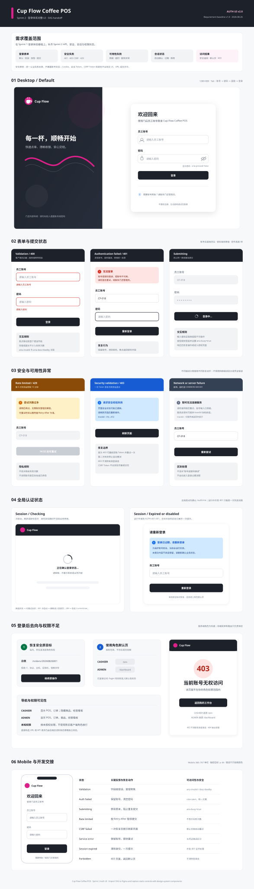

# Cup Flow Coffee POS — Sprint 2 登录 UI/UX 设计

## 交付物

| 文件 | 用途 |
| --- | --- |
| [cup-flow-auth-login.svg](./cup-flow-auth-login.svg) | 可导入 Figma 的 Sprint 2 登录体系完整 UI 画板 |

该画板以 Sprint 1 的 `doc/sprint1/auth/cup-flow-auth-login.svg` 为视觉基线，并按 Sprint 2 `PRD.md`、`API_CONTRACT.md`、`AUTH_FLOW.md` 与 `AUTH_SEQUENCE.md` 补齐状态。Sprint 1 原稿保持不变，作为历史设计基线。

## 完整性审查

| 需求状态 | Sprint 1 原稿 | Sprint 2 处理 |
| --- | --- | --- |
| 默认登录、密码显隐、字段校验、提交中 | 已覆盖 | 保留并统一到 v2 画板 |
| 账号不存在、密码错误、账号停用 | 已覆盖统一文案 | 修正为失败后保留账号、清空密码并聚焦密码字段 |
| 登录限流 `AUTH-429-001` | 缺失 | 增加限流提示、`Retry-After` 倒计时和禁用提交状态 |
| CSRF `AUTH-403-002` | 缺失 | 增加一次 Token 恢复仍失败后的刷新页面状态 |
| 网络、超时、服务异常 | 缺失 | 增加独立提示、保留账号和重试动作 |
| 应用启动会话确认 | 缺失 | 增加全局加载页，确认完成前不展示业务内容 |
| 会话过期或账号停用 | 部分覆盖 | 增加并发 401 合并说明，并修正重新登录后的安全返回规则 |
| 安全返回地址和角色默认页 | 仅默认页 | 增加有权原目标恢复与非法、无权目标降级规则 |
| 页面权限不足 | 缺失 | 增加独立 403 页面且不清除有效登录态 |
| 响应式和可访问性 | 已覆盖 | 保留 Mobile 基线并补齐新增状态的交接规则 |

## 核心交互规则

- 登录表单不提供注册、忘记密码或“记住我”。
- 账号去除首尾空白；密码保持原值。空值和超长输入不发送登录请求，也不计入登录失败次数。
- 登录失败统一显示“账号或密码错误，或账号不可用”，不得暴露账号是否存在或停用。
- `429` 按服务端 `Retry-After` 暂停提交，不展示剩余失败次数。
- `AUTH-403-002` 最多重新获取 CSRF Token 并重试一次；仍失败时停止重试并提示刷新页面。
- 冷启动先查询当前身份，完成前显示全局加载状态，不短暂展示未授权内容。
- 运行中 `AUTH-401-001` 清除内存身份，并发响应只触发一次跳转和过期提示。
- 网络或服务异常不等同于认证失败或会话失效，保留可恢复操作。
- 安全、存在且有权的原目标可恢复；否则 `CASHIER` 进入 `/pos`，`ADMIN` 进入 `/dashboard`。
- 403 与 404 分开处理；403 不清除有效登录态。

## Figma 交接

1. 将 SVG 拖入 Figma 的 Sprint 2 Auth 页面。
2. 按 `cf-s2-auth-*` 顶层分组转换为 Frame。
3. 使用现有 Input、Button、Alert、Spinner 与 App Shell 组件替换静态矢量。
4. 绑定 Foundation Variables，并补充 Auto Layout、Prototype 与响应式约束。
5. 按画板末尾交接表验证键盘顺序、焦点、错误朗读、加载状态和恢复动作。

SVG 是设计交付与评审基线，不替代前后端对 `API_CONTRACT.md` 的实现。
